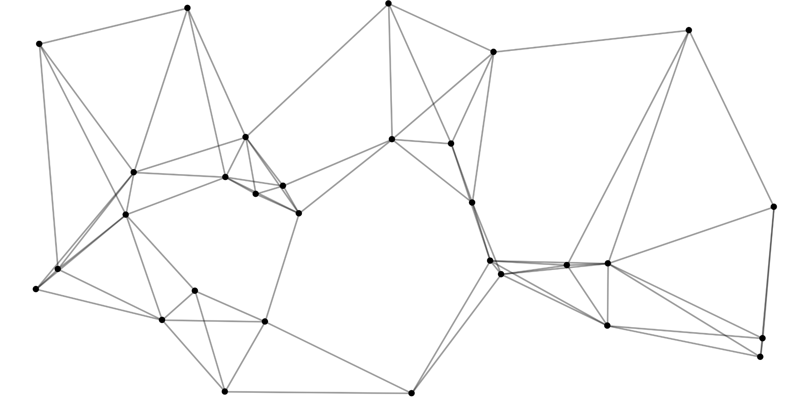

## Network Visualizer

Generate a random graph structure connecting the k-nearest nodes and edges using the p5.js library.

## Usage

  `npm install`

  `npm run build`

  `npm start`

There are a couple of dependencies, `p5` for manipulating the HTML5 canvas and `express` for serving a simple Node app. The build step is optional as it is already bundled under `public/js/network-viz.bundle.js`. 

## Tests

TODO